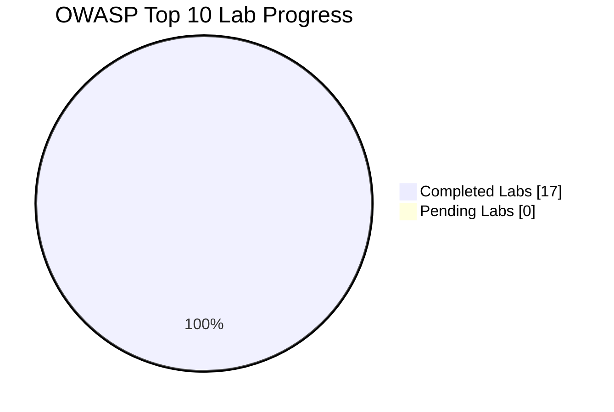

# 🔐 OWASP Top 10 — Hands-on Lab Writeups

_A curated collection of PortSwigger-style lab writeups, notes, and exploits for the OWASP Top 10 vulnerabilities._

**Overall progress:** 17 / 17 labs completed.

```mermaid
pie showData
  title OWASP Top 10 Lab Progress
  "Completed Labs" : 17
  "Pending Labs" : 0
```

## 📂 Categories

- 🟢 **01 Broken Access Control** — 13 / 13 completed — [View](01_Broken_Access_Control/README.md)
- 🔵 **02 Security Misconfiguration** — 4 / 4 completed — [View](02_Security_Misconfiguration/README.md)

## 🧪 Recent Labs

| Status | Lab | Category | Tags |
|--------|-----|----------|------|
| ✅ | [Insecure Direct Object References Can Be Exploited](01_Broken_Access_Control/Insecure%20Direct%20Object%20References%20Can%20Be%20Exploited.md) | 01 Broken Access Control | `Insecure-Direct-Object-References, IDOR, Path-Traversal-Like, File-Access, Credential-Leak` |
| ✅ | [Method-Based Access Control Can Be Circumvented](01_Broken_Access_Control/Method-Based%20Access%20Control%20Can%20Be%20Circumvented.md) | 01 Broken Access Control | `Broken-Access-Control, HTTP-Method, Verb-Tampering, GET-vs-POST, Authorization-Bypass` |
| ✅ | [Multi-step Process with Missing Access Control on Final Step](01_Broken_Access_Control/Multi-step%20Process%20with%20Missing%20Access%20Control%20on%20Final%20Step.md) | 01 Broken Access Control | `Broken-Access-Control, Business-Logic-Flaw, Missing-Authorization, Session-Reuse, Admin-Privilege-Escalation` |
| ✅ | [Referer-Based Access Control Can Be Spoofed](01_Broken_Access_Control/Referer-Based%20Access%20Control%20Can%20Be%20Spoofed.md) | 01 Broken Access Control | `Broken-Access-Control, Referer-Spoofing, Header-Tampering, Admin-Bypass, Privilege-Escalation` |
| ✅ | [URL-Based Access Control Can Be Circumvented](01_Broken_Access_Control/URL-Based%20Access%20Control%20Can%20Be%20Circumvented.md) | 01 Broken Access Control | `Broken-Access-Control, Admin-Panel, X-Original-URL, Front-End-Routing, Access-Control-Bypass` |
| ✅ | [Unprotected Admin Functionality with Unpredictable URL](01_Broken_Access_Control/Unprotected%20Admin%20Functionality%20with%20Unpredictable%20URL.md) | 01 Broken Access Control | `Broken-Access-Control, Admin-Panel, Info-Disclosure, Client-Side-Code` |
| ✅ | [Unprotected Admin Functionality](01_Broken_Access_Control/Unprotected%20Admin%20Functionality.md) | 01 Broken Access Control | `Broken-Access-Control, Admin-Panel, Info-Disclosure, Robots.txt` |
| ✅ | [User ID Controlled by Request Parameter](01_Broken_Access_Control/User%20ID%20Controlled%20by%20Request%20Parameter%20.md) | 01 Broken Access Control | `Broken-Access-Control, Horizontal-Privilege-Escalation, ID-Parameter, API-Key-Disclosure` |
| ✅ | [User ID Controlled by Request Parameter with Data Leakage in Redirect](01_Broken_Access_Control/User%20ID%20Controlled%20by%20Request%20Parameter%20with%20Data%20Leakage%20in%20Redirect.md) | 01 Broken Access Control | `Broken-Access-Control, IDOR, Data-Leakage, Redirect-Response, API-Key-Disclosure` |
| ✅ | [User ID Controlled by Request Parameter with Password Disclosure](01_Broken_Access_Control/User%20ID%20Controlled%20by%20Request%20Parameter%20with%20Password%20Disclosure.md) | 01 Broken Access Control | `Broken-Access-Control, IDOR, Password-Disclosure, Horizontal-Privilege-Escalation, Admin-Access` |
| ✅ | [User ID Controlled by Request Parameter with Unpredictable User IDs](01_Broken_Access_Control/User%20ID%20Controlled%20by%20Request%20Parameter%20with%20Unpredictable%20User%20IDs.md) | 01 Broken Access Control | `Broken-Access-Control, Horizontal-Privilege-Escalation, IDOR, GUID-User-ID, API-Key-Disclosure` |
| ✅ | [User Role Can Be Modified in User Profile](01_Broken_Access_Control/User%20Role%20Can%20Be%20Modified%20in%20User%20Profile.md) | 01 Broken Access Control | `Broken-Access-Control, Mass-Assignment, JSON-Tampering, Privilege-Escalation, Insecure-Deserialization` |
| ✅ | [User Role Controlled by Request Parameter](01_Broken_Access_Control/User%20Role%20Controlled%20by%20Request%20Parameter.md) | 01 Broken Access Control | `Broken-Access-Control, Admin-Panel, Cookie-Manipulation, Horizontal-Privilege-Escalation` |
| ✅ | [Authentication Bypass via Information Disclosure](02_Security_Misconfiguration/Authentication%20Bypass%20via%20Information%20Disclosure.md) | 02 Security Misconfiguration | `Authentication-Bypass, Information-Disclosure, Custom-Header, Localhost-Check, TRACE-Method, IP-Spoofing` |
| ✅ | [Information Disclosure via Exposed Debug Page](02_Security_Misconfiguration/Information%20Disclosure%20via%20Exposed%20Debug%20Page.md) | 02 Security Misconfiguration | `Security-Misconfiguration, Information-Disclosure, Debug-Page, phpinfo, Secret-Leak, Environment-Variables` |
| ✅ | [Information Disclosure via Verbose Error Messages](02_Security_Misconfiguration/Information%20Disclosure%20via%20Verbose%20Error%20Messages.md) | 02 Security Misconfiguration | `Security-Misconfiguration, Information-Disclosure, Verbose-Error-Messages, Framework-Fingerprinting, Apache-Struts` |
| ✅ | [Source Code Disclosure via Backup Files](02_Security_Misconfiguration/Source%20Code%20Disclosure%20via%20Backup%20Files.md) | 02 Security Misconfiguration | `Security-Misconfiguration, Information-Disclosure, Source-Code-Leak, Backup-Files, Hardcoded-Credentials, Directory-Enumeration` |

## 🤝 How to Contribute

- Follow the filename and folder conventions: `NN-CategoryName/Lab-Name-ID.md`
- Include front-matter at the top of each lab (see templates).
- Submit a PR 🚀

## ⚠️ Disclaimer

> This repository is for **educational purposes only**.  
> Do not attempt these techniques on systems you don't own or have explicit permission to test.
