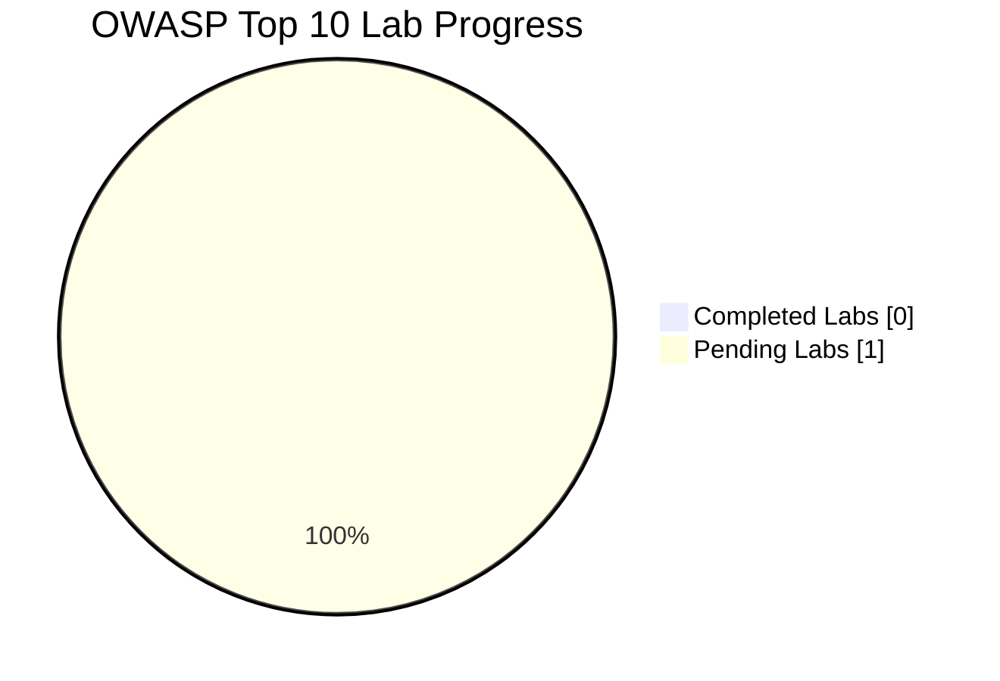

# 🔐 OWASP Top 10 — Hands-on Lab Writeups

_A curated collection of PortSwigger-style lab writeups, notes, and exploits for the OWASP Top 10 vulnerabilities._

**Overall progress:** 0 / 1 labs completed.

## 📂 Categories

- 🟢 **01 Broken Access Control** — 0 / 1 completed — [View](01_Broken_Access_Control/README.md)

## 🧪 Recent Labs

| Status | Lab | Category | Tags |
|--------|-----|----------|------|
| ⬜ | [Unprotected Admin Functionality](01_Broken_Access_Control/Unprotected Admin Functionality.md) | 01 Broken Access Control | `-` |

## 🤝 How to Contribute

- Follow the filename and folder conventions: `NN-CategoryName/Lab-Name-ID.md`
- Include front-matter at the top of each lab (see templates).
- Submit a PR 🚀

## ⚠️ Disclaimer

> This repository is for **educational purposes only**.  
> Do not attempt these techniques on systems you don’t own or have explicit permission to test.
